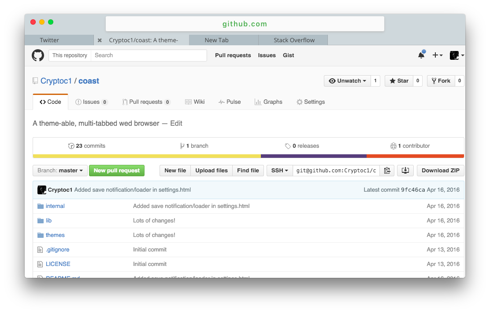

# Coast
Coast is a theme-able, multi-tabbed "browser" through the power of electron.

## Screenshots
All screenshots can be found in [screenshots.md](/screenshots/screenshots.md)

The following screenshots are with the "simple" theme.
<figure>
<figcaption>New tab page</figcaption>

</figure>
<figure>
<figcaption>Multiple tabs</figcaption>

</figure>
<figure>
<figcaption>Green omnibar texts on HTTPS connections</figcaption>

</figure>

## Features
- Theme-able:

    Coast makes it easy for you to customize the general appearance of the browser, as well as some of the internal urls, like the new-tab page.
- Utilizes node/electron:

    What could be better than a web browser that's built on top of web technologies..?
- Keyboard Shortcuts:

    Coast comes with a bunch of keyboard shortcuts to make using the browser quicker and easier.

## TODO
- Loader in omnibar
- Add keyboard shortcut listing to `coast:settings`
- Work on downloads
- Create Menubar menus
- Create context menus
- In settings, make it so certain CSS/JS can be injected into certain websites
- Suggestions when typing in the omnibar
- Adblock filtering?
