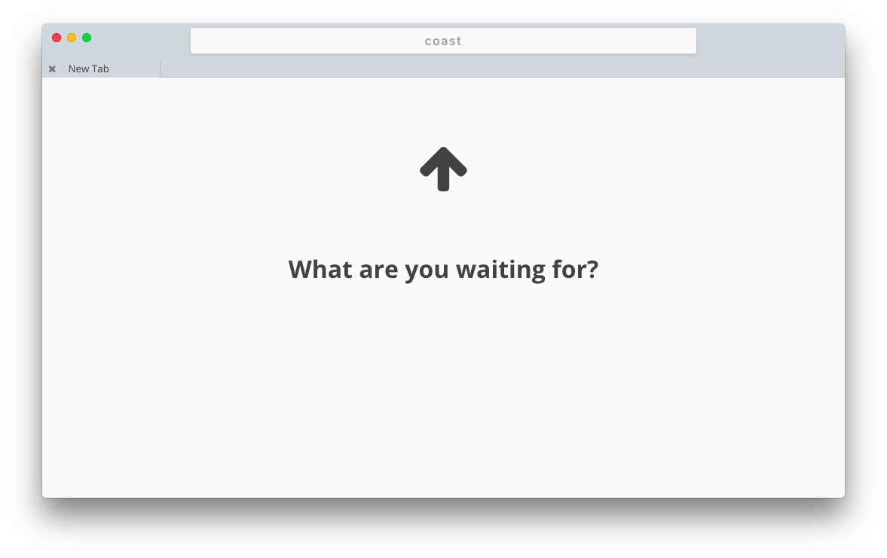
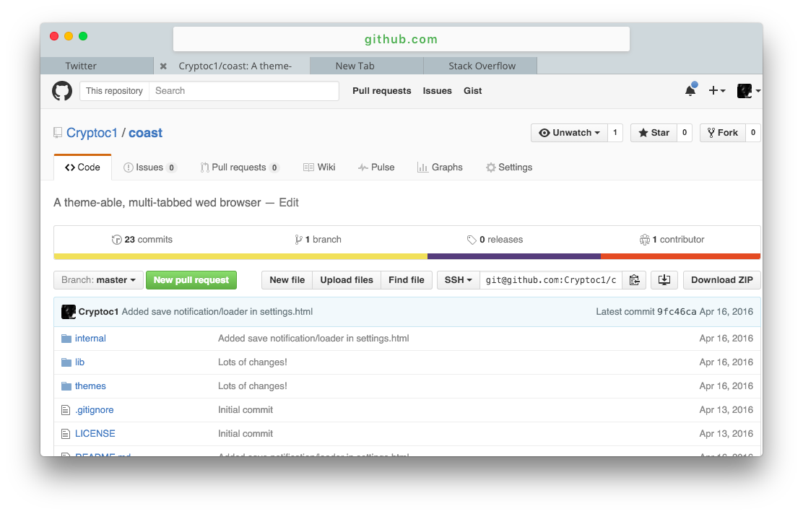
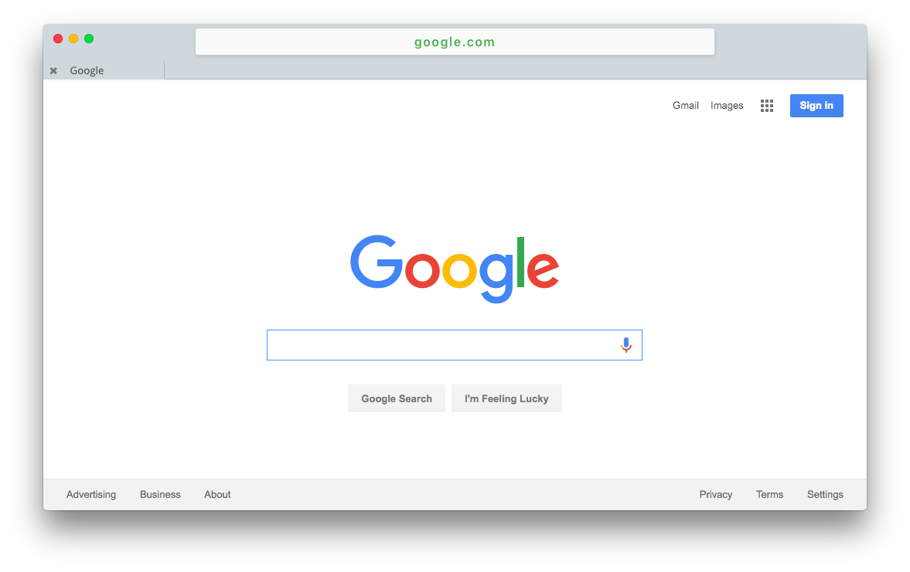
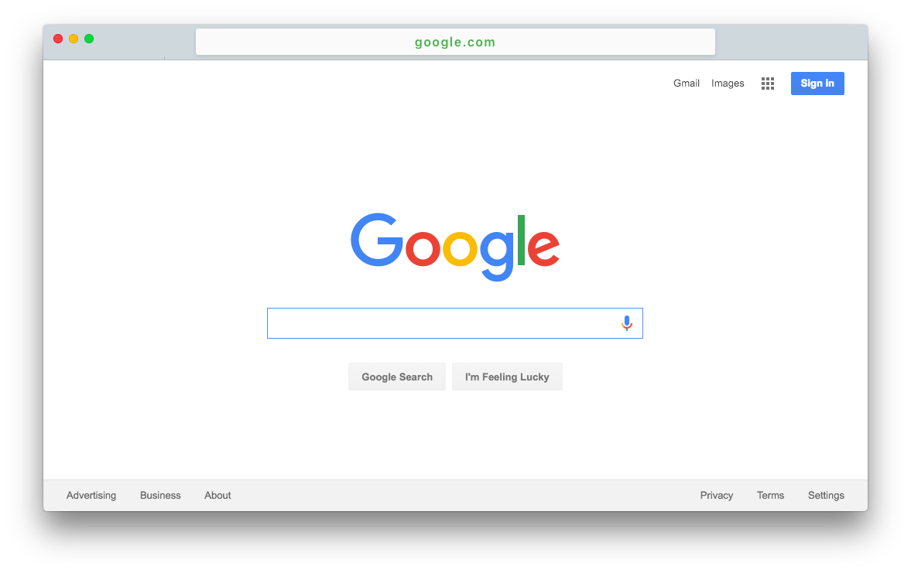
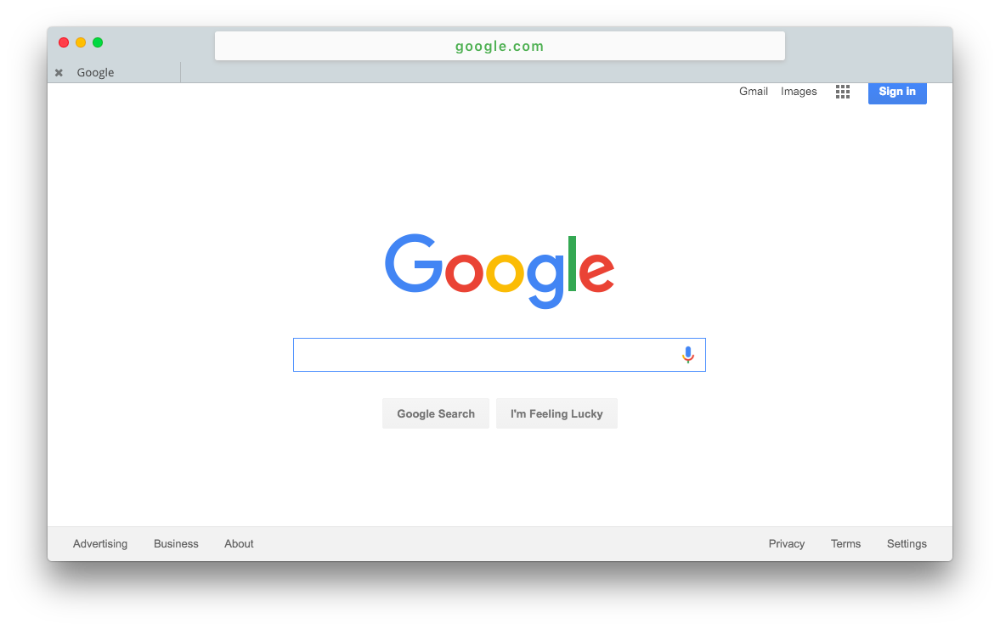
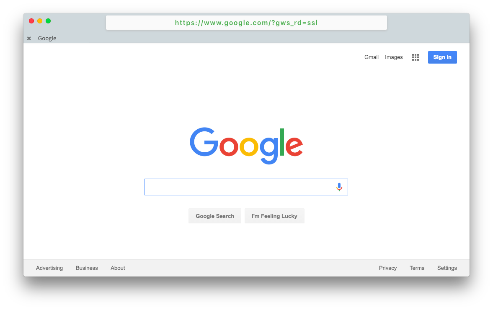

## Screenshots

### Simple Theme
<figure>
<figcaption>New Tab Page:</figcaption>

</figure>
<figure>
<figcaption>Multiple Tabs:</figcaption>

</figure>
<figure>
<figcaption>Green Omnibar Text on HTTPS Connections:</figcaption>

</figure>

### Compact Theme
<figure>
<figcaption>Hidden Tabbar:</figcaption>

</figure>
<figure>
<figcaption>Tabbar Revealed When Navigation Bar is Hovered Over:</figcaption>

</figure>

### Other
<figure>
<figcaption>Green Omnibar Text on HTTPS Connections</figcaption>

</figure>
<figure>
<figcaption>Hovering Over Omnibar Reveals Full Address</figcaption>

</figure>
